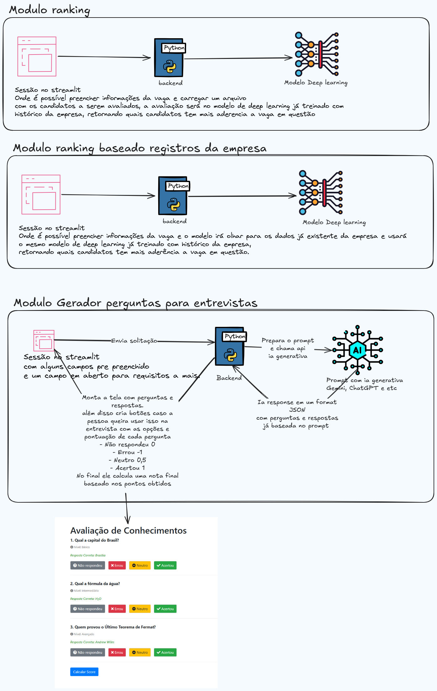

# Datathon

Este projeto contém as soluções e os materiais desenvolvidos para participação em um Datathon. 
O objetivo principal é aplicar técnicas de análise de dados, machine learning e visualização
para resolver um problema específico proposto no evento, utilizando os datasets fornecidos.
Pode incluir também o desenvolvimento de aplicações web interativas com Streamlit para demonstrar os resultados.

Aqui você encontrará os notebooks, scripts, modelos e quaisquer outros artefatos 
relevantes gerados durante a competição.

## Desenho das funcionalidades



## Como Rodar Localmente

Para executar este projeto em seu ambiente local, siga os passos abaixo. 
Certifique-se de ter os pré-requisitos necessários instalados (como Python, pip, Conda, etc., 
dependendo das tecnologias utilizadas no projeto, incluindo Streamlit se aplicável).

1.  **Clone o repositório:**
    ```bash
    git clone <URL_DO_SEU_REPOSITORIO>
    cd datathon 
    ```

2.  **Crie e ative um ambiente virtual (recomendado):**
    ```bash
    python -m venv venv
    # No Windows
    .\venv\Scripts\activate
    # No macOS/Linux
    source venv/bin/activate
    ```

3.  **Instale as dependências:**
    (Adicione aqui o comando para instalar as dependências, por exemplo, se você tiver um arquivo `requirements.txt`)
    ```bash
    pip install -r requirements.txt 
    ```

4.  **Execute o projeto:**
    (Adicione aqui as instruções específicas para rodar o projeto, por exemplo, como abrir um Jupyter Notebook, executar um script Python, etc.)
    ```bash
    # Exemplo para Jupyter Notebook: jupyter notebook
    # Exemplo para script Python: python seu_script_principal.py
    # Exemplo para aplicação Streamlit: streamlit run seu_app_streamlit.py
    ```

Lembre-se de substituir `<URL_DO_SEU_REPOSITORIO>` pela URL correta do seu repositório Git e adaptar os comandos de instalação de dependências e execução conforme a estrutura e as tecnologias do seu projeto.
